# Fantasy World — UI/UX Menu Flow Overview

This document contains the complete UI/UX hierarchy and menu flow map for the game, spanning from the diverse Main Menu backgrounds down into the deepest branches of gameplay, multiplayer lobbies, and settings. 

```mermaid
%%{init: {"flowchart": {"curve": "stepBefore"}}}%%
flowchart LR
    root["Fantasy World UI/UX Flow"] --> MainMenu["Main Menu"]

    MainMenu --> MenuBackgrounds["Dynamic Backgrounds"]
    MenuBackgrounds --> Tavern["Cozy Tavern"]
    MenuBackgrounds --> BattlefieldTent["Battlefield Tent"]
    MenuBackgrounds --> DiningHall["Dining Hall"]
    MenuBackgrounds --> DeforestedWoods["Deforested Woods"]
    
    MainMenu --> PlayGame["Play Game"]
    PlayGame --> CreateLocalMatch["Create Local Match"]
    
    CreateLocalMatch --> MatchSetup["Match Setup"]
    MatchSetup --> MapSelection["Environment Selection"]
    MapSelection --> EnvTavern["Cozy Tavern"]
    MapSelection --> EnvBattlefield["Battlefield Tent"]
    MapSelection --> EnvDiningHall["Dining Hall"]
    MapSelection --> EnvDeforestedWoods["Deforested Woods"]
    
    MatchSetup --> DeckBuilding["Deck Selection Phase"]
    DeckBuilding --> GroundTank["Select 1 Ground Tank"]
    DeckBuilding --> AirHybrid["Select 1 Air/Hybrid"]
    DeckBuilding --> RangedMagic["Select 1 Ranged/Magic"]
    DeckBuilding --> FlexSupport["Select 1 Flex/Support"]
    DeckBuilding --> ManaCheck["Verify Mana Total ≤ 22"]
    
    CreateLocalMatch --> InGamePlay["In-Game View"]
    InGamePlay --> HUD["Heads-Up Display"]
    HUD --> BottomBar["Bottom Bar - 4 Cards"]
    HUD --> ResourceDisplay["Gold & XP Counters"]
    HUD --> TurnIndicator["Turn Timer & Combat Log"]
    HUD --> HitChance["Hit Chance & Damage Prediction"]
    
    InGamePlay --> ActionMenu["Radial Action Menu"]
    ActionMenu --> MoveAction["Move - Blue Hexes"]
    ActionMenu --> AttackAction["Combat Select - Red Hexes"]
    AttackAction --> SelectMove["Choose Move: Standard / Power / Precision / Special"]
    AttackAction --> DefensiveStance["Auto / Manual Stance Select"]
    ActionMenu --> MineAction["Place Gold Mine"]
    ActionMenu --> UpgradeAction["Upgrade Troop"]
    ActionMenu --> ItemAction["Use Consumable Item"]
    ActionMenu --> EndTurn["End Turn"]
    
    InGamePlay --> PauseMenu["Pause Menu"]
    PauseMenu --> ResumeGame["Resume"]
    PauseMenu --> PauseSettings["Settings Overlay"]
    PauseMenu --> SaveGame["Save Game"]
    PauseMenu --> QuitToMenu["Quit to Main Menu"]
    
    InGamePlay --> EndGameScreen["Game Over Overlay"]
    EndGameScreen --> VictoryDefeat["Victory / Defeat Animation"]
    EndGameScreen --> RematchOption["Request Rematch"]
    EndGameScreen --> ReturnToMenu["Return to Menu"]
    
    MainMenu --> OnlineMultiplayer["Online Multiplayer"]
    OnlineMultiplayer --> HostMatch["Host Multiplayer"]
    HostMatch --> HostLobby["Multiplayer Host Lobby"]
    HostLobby --> WaitForPlayer["Wait for Peer Connection"]
    HostLobby --> HostSettings["Host Selects Map / Timer Rules"]
    HostLobby --> HostDeck["Simultaneous Deck Selection"]
    HostLobby --> StartMPMatch["Sync RNG Seed -> Start Match"]
    
    OnlineMultiplayer --> JoinMatch["Join Match"]
    JoinMatch --> EnterCode["Enter IP / Room Code"]
    JoinMatch --> ClientLobby["Multiplayer Client Lobby"]
    ClientLobby --> ClientDeck["Simultaneous Deck Selection"]
    ClientLobby --> ReadyUpToggle["Toggle Ready Status"]
            
    MainMenu --> TheArchives["The Archives"]
    TheArchives --> CardGallery["Troop Card Gallery"]
    CardGallery --> ViewStats["View Stats/Moves for all 12 Troops"]
    
    TheArchives --> LoreBestiary["Rules & Lore Reference"]
    LoreBestiary --> NPCGlossary["NPCs: Goblin, Orc, Troll"]
    LoreBestiary --> BiomeEffects["Biome Modifier Effectiveness Chart"]
    LoreBestiary --> CombatRules["Hit Calculations & Ruleset"]
          
    MainMenu --> Tutorial["Tutorial"]
    Tutorial --> BasicAttack["1. Basic Attack"]
    Tutorial --> MoveVariety["2. Move Variety"]
    Tutorial --> TypeMatchups["3. Type Effectiveness"]
    Tutorial --> DefensiveStance["4. Defensive Stances"]
    Tutorial --> Positioning["5. Positioning & Cover"]
    Tutorial --> FullCombat["6. Full Combat Simulation"]
        
    MainMenu --> Settings["Settings"]
    Settings --> GraphicsSettings["Graphics & Video"]
    GraphicsSettings --> QualityPresets["Presets: Low / Med / High / Ultra"]
    GraphicsSettings --> ResMode["Resolution & Window Mode"]
    GraphicsSettings --> VsyncAA["VSync & Anti-Aliasing"]
    
    Settings --> GameplaySettings["Gameplay"]
    GameplaySettings --> SmoothZoom["Smooth Scrolling Zoom Toggle"]
    GameplaySettings --> AIDifficulty["AI Level: Easy / Normal / Hard"]
    GameplaySettings --> CombatMode["Combat: Standard / Simplified"]
    
    Settings --> AudioSettings["Audio Sliders"]
    AudioSettings --> MasterVol["Master Volume"]
    AudioSettings --> MusicVol["Music Volume"]
    AudioSettings --> SFXVol["SFX Audio"]
          
    MainMenu --> Credits["Credits"]
    Credits --> TeamMembers["Development Team Roles"]
    Credits --> AssetCredits["Asset Sources & Acknowledgements"]
        
    MainMenu --> QuitGame["Quit Game"]
    QuitGame --> ConfirmQuit["Exit Confirmation"]
    ConfirmQuit --> YesQuit["Yes - Exit to Desktop"]
    ConfirmQuit --> NoCancel["No - Return to Main Menu"]
```

